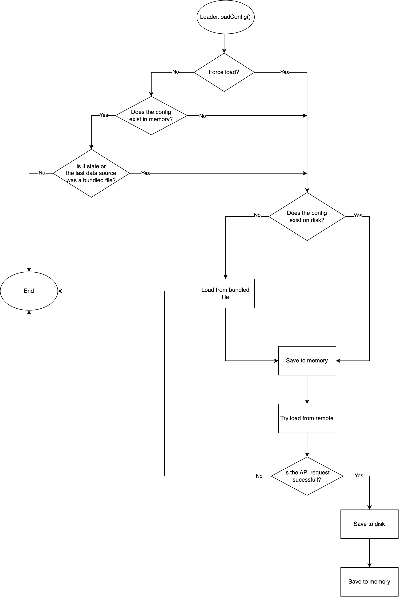
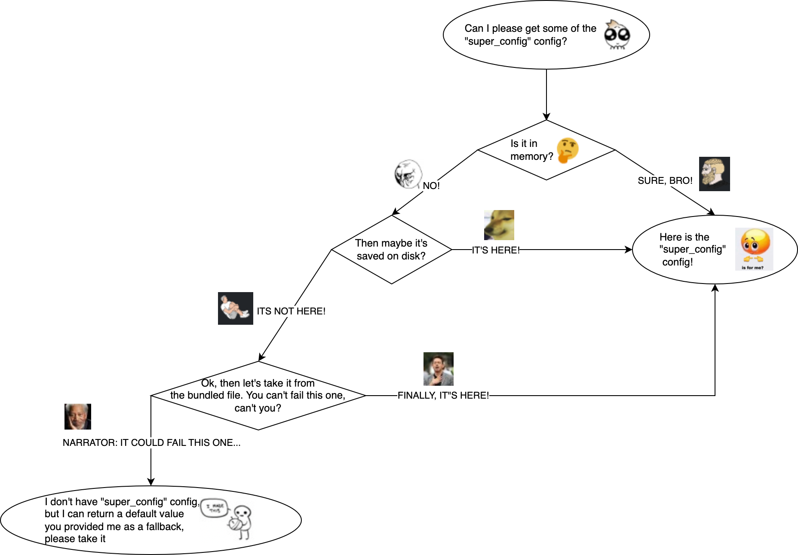

# Configurations
During the lifetime of the app, we fetch and update the following configurations

## Global config
It’s used to get a list of all supported countries for every brand. It is one of the first APIs we call when a user launches the app. We store it locally, and we use it to determine if the selected user country address is supported.

**URL**:
https://global.fd-api.com/configuration/getmobilecountries

**Query params**:
`brand`
`environment`
`version`

**Example**:
https://global.fd-api.com/configuration/getmobilecountries?environment=staging&brand=foodora&version=5.0

## Country (Api) Config
This is the config for each country which contains the language, currency, cuisines and much more. This config is fetched once on app startup if user has previously selected address, and when user changes country.

We construct the url based on global country url(base url).

**URL**:
`https://{globalConfig.url}/configuration`

**Example**:
`https://sg-st.fd-api.com/api/v5/configuration?language_id=0`

## Static feature config(S3 Config)
It is used to define feature configs for each country. This is static file hosted on s3

**URL**:
`https://static.fd-api.com/feature-config/{environment}/{countryCode}/config.json`

**Path params**:
`environment`
`countryCode`

**Query params**:
v - (app’s version number, optional)

**Example**:
`https://static.fd-api.com/feature-config/staging/hk/config.json?v=254704`

**[Github repository](https://github.com/deliveryhero/static.fd-api.com)**

## Remote Config
This is Firebase config. This config is used as feature management in our app. We also use it for force updating users. Each flag can be configured to specific user/s, country/s, and different criteria.

**Read more**:
`https://firebase.google.com/docs/remote-config`

## Feature Toggle ([Fun With Flag](https://management.fwf.deliveryhero.net/))
This config is used as feature management (AB feature testing) in our app. Also it’s used for phase rollout features. Each flag can be configured to specific user/s, country/s, and different criteria.

[FwF Q&A](https://docs.google.com/document/d/1FkojJ96YX_eneAxOQBW_55IOrhJnGnA_YM-TFAz__CE/edit)

## How access configs from code?

1. Add `projects.configsApi` dependency to your module

2. Inject required config provider:
    - `RemoteConfigProvider`
    - `StaticConfigProvider`
    - `ApiConfig`
    - `VariationProvider`

3. Reading a config of a primitive type
    ```kotlin
      val isMyConfigEnabled = remoteConfigProvider.getBoolean(
        key = "is_my_config_enabled", // name of the config, how it's coming from the remote data source 
        fallback = false // value that will be returned if the config doesn't exist or if it's not boolean
      )
    ```

4. Reading a config of a custom type
    ```kotlin
      // declare the type, make sure to add @Serializable annotation from kotlinx.serialization
      @Serializable
      data class MyConfig (
          val isEnabled: Boolean,
          val nestedObject: NestedConfig // note that nested objects should also be serializable
      )
   ```

   ```kotlin   
      val myConfig = staticConfigProvider.getObject(
        key = "my_config", // name of the config, how it's coming from the remote data source 
        fallback = MyConfig(), // value that will be returned if the config doesn't exist or if it can't be deserialized to MyConfig,
        strategy = serializer() // usually this field can be omitted, unless a custom deserialization strategy is required
      )
   ```
   
## How to access configs for TA?
1. Add `projects.configsTesting` dependency to your module
2. Feature toggles or `VariationProvider`can be mocked with values as below
    ```kotlin
      package com.deliveryhero.pandora.test.tests.configs
    
      class ExampleTest {
       
          @Test 
          fun testSomething() {
              enableAutoCompleteVariationProvider()
            
              // Your test goes here
          }
        
          private fun enableAutoCompleteVariationProvider() {
              TestInjector.getVariationProvider().putString(AUTOCOMPLETE_CONFIG, value)
          }
      }
    ```
3. `StaticConfigProvider`, `RemoteConfigProvider` and `ApiConfigProvider` can be injected in the test class directly and can be mutated where required:
    ```kotlin
      package com.deliveryhero.pandora.test.tests.configs
            
      import com.deliveryhero.configs.api.RemoteConfigProvider
      import com.deliveryhero.configs.testing.mutate
      import com.deliveryhero.configs.testing.putObject
    
      class ExampleTest {
        
          // injecting the static configs to mutate on some values
          @Inject
          lateinit var staticConfigProvider: StaticConfigProvider
    
          // injecting the remote configs to mutate on some values
          @Inject 
          lateinit var remoteConfigProvider: RemoteConfigProvider
    
          // injecting the api configs to mutate on some values
          @Inject
          lateinit var apiConfigProvider: ApiConfigProvider
    
          @Test
          fun testSomething() {
              enableShopStaticConfigs()
              enableHomeScreenApiConfig()
              enableRewardsRemoteConfig()
            
              // Your test goes here
          }
        
          private fun enableShopStaticConfig() {
              staticConfigProvider.mutate {
                  putObject("shops", ShopConfig(Status(true), entryThreshold))
              }
          }
        
          private fun enableHomeScreenApiConfig() {
              apiConfigProvider.mutate {
                  putObject("new_home_screen_enabled", HomeScreen(enabled = true))
              }
          }
    
          private fun enableRewardsRemoteConfig() {
              remoteConfigProvider.mutate {
                  putObject("rewards_variant", RewardsVariant(variant = "home_listing"))
              }
          }
      }
    ```
4. `putString`, `putBoolean` and `putInt` methods can be used from the different config providers in different use cases.


## Overview of config data sources

The following diagrams are describing the config loading and fetching algorithms and are intended to help with understanding of what config data sources are used to return the config values. 

### 1. Load Config Flow

This flow is updating the in-memory configs and is usually called on app start-up and user login.

The diagram represents a config-loading logic, when `ConfigLoader.loadConfig(configType)` for any type of config is called:




### 2. Get Config Flow

This flow is returning a specific config from the local data sources.

This diagram is showing where the requested config comes from, when any `{Type}ConfigProvider.getConfig(configName)` is called:




