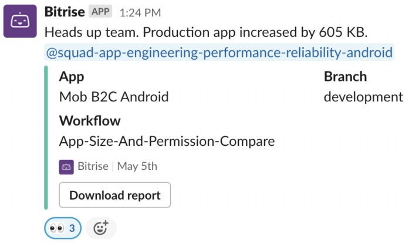
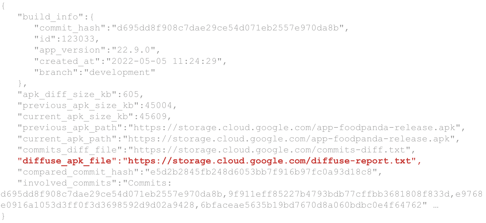
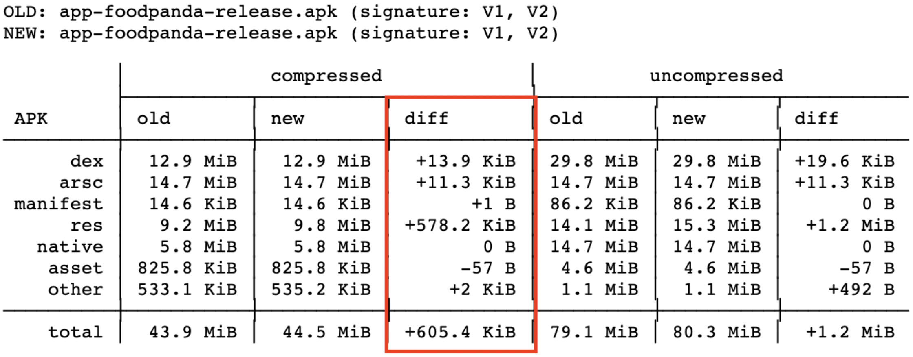
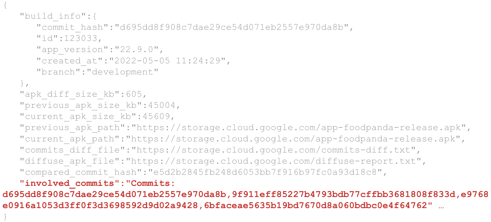

# App size regression detection on development branch
This section describes how app size regression is being detected on development branch.

## Introduction
Automated tool to detect app size regression on development branch. Declared bitrise workflow `App-Size-Compare`.
Parent workflow: `App-Size-And-Permission-Compare` which is being triggered every 3h per day

## App-Size-Compare workflow description
Steps that should be done before app size comparison:

- Android build - builds universal apk
- Authenticate to gcloud

**Apks comparison logic:**

Built apk is being uploaded to gcloud in every `App-Size-Compare` workflow run, to be able to retrieve it at next time when workflow is triggered. The comparison happens between apks from previous(uploaded in previous `App-Size-Compare` workflow run) and current(built in current `App-Size-Compare` workflow) apks.
To start apks comparison, the [compare-app-size.sh](https://github.com/deliveryhero/pd-mob-b2c-android/blob/development/scripts/compare-app-size.sh) should be called.

Parameters required for `compare-app-size.sh`:
- *threshold-kb=75* (approximate size threshold to be notified if it's reached).

**Apks comparison steps**

1. Download previous apk from gcloud
2. Collect size metrics from apks
3. Collect involved commits between current and previous workflow builds(commit hash of every build is stored)
4. Get detailed apks comparison report using [diffuse](https://github.com/JakeWharton/diffuse) util
5. Upload current built apk to gcloud and size metrics to bq(will be used at next workflow build)
6. Prepare message that should be printed in slack `#pd-tech-android` channel if regression detected

Post a message on slack `#pd-tech-android` channel if size regression detected.

## What to do when size regression happened (Only for App performance squad developers)
As soon as size regression detected and notification message appeared in `#pd-tech-android` channel, click on `Download report` button to open the full report.

1. Take a look at `diffuse_apk_file` field, which contains url for detailed apks comparison report. Open that link.

2. Look at the `diff` column to understand what was significantly increased, in this picture the `res` has been increased by 578kb, which shows that in some commits resources were added.

3. Next field that should be checked is `involved_commits` which contains all involved commits between 2 workflow builds

4. Check all the involved commits hash to find a commit(s) that was a cause of size regression
Just pass the commit at the end of github url. Example: https://github.com/deliveryhero/pd-mob-b2c-android/commit/<involved commit>

5. Once the cause was found, post the link of commit(s) of regression as a reply to regression detection notification. Ping owner of this commit to discuss if regression is avoidable

## Additional information
All the size metrics can be found in big query table `android-foodora.pd_mobile_performance.apk_size_compare`
