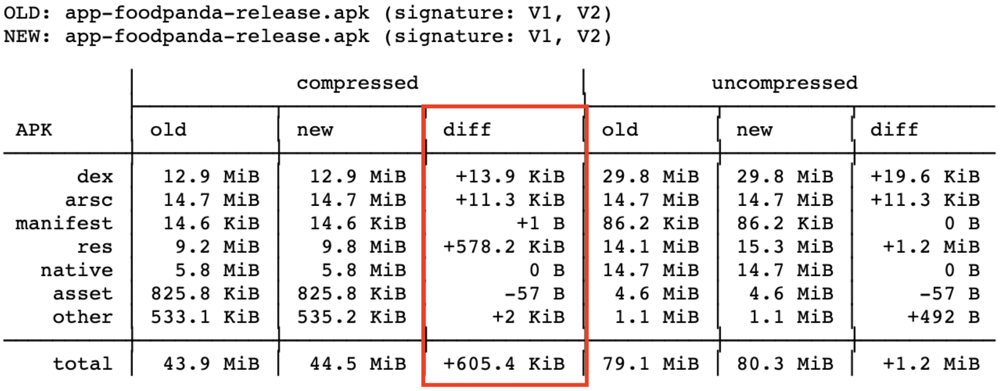

# App size regression detection on Pull requests
This section describes how app size regression is being detected on Pull requests targeting development branch.

## Overview
Automated tool to detect app size regression on every Pull requests.
The tool contains two parts:
1. Collecting size metrics in every commit on development branch. Workflow name `Check-Development-App-Size`
2. App size comparison in Pull requests. Downloads development build and compares with current(PR) build. Detects size regression to block/unblock PR.

### Collect app size metrics in every development commit
Declared workflow: `Check-Development-App-Size`. 
Reason to trigger the workflow in every commit on development branch: 
- keep actual size metrics in development, to be able to retrieve needed development build anytime from Pull request and compare it with PR build

**Check-Development-App-Size**
Being triggered via [pd-mob-github-hook](https://github.com/deliveryhero/pd-mob-github-hook) which listens push events in development branch and triggers bitrise `Check-Development-App-Size` workflow.

Required initial steps:
- authenticate to gcloud

**Size metrics collection**

1. Clone [pd-mobile-app-size](https://github.com/deliveryhero/pd-mobile-app-size) as a submodule.
2. Declare database tables where the metrics will be stored. `android-foodora.pd_mobile_performance.android_dev_app_size` table is used for development builds.
3. Build app bundle
4. Pass app bundle binary to pd-mobile-app-size repo calling `main.sh` with required parameters
    - platform - specifies platform [android/ios -> android]
    - binary-path - path of built app bundle
    - environment - specifies which flow will be run [dev/pr -> dev]
    ```shell
    bash pd-mobile-app-size/main.sh --platform "android" --binary-path "<path of app bundle>" --environment "dev"
    ```
5. Upload size metrics to gcloud and bq(will be used from PRs later)

### Detect app size regression in Pull requests
Declared workflow(pipeline): `Compare-Pull-Request-App-Size` is triggered in every PR commit.
Downloads development build depending on ancestor(head) commit and compares it with PR build.

Required initial steps:
- authenticate to gcloud

**Size comparison**

1. Check git changed files to decide either app size check is required or not, using [check_files.sh](https://github.com/deliveryhero/pd-mob-b2c-android/blob/development/scripts/gitfiles/check_files.sh). The directories and files that should be checked in git changed files are declared in [scripts/gitfiles/app_size_affecting_files.txt](https://github.com/deliveryhero/pd-mob-b2c-android/blob/development/scripts/gitfiles/app_size_affecting_files.txt). If required to check additional files/directories, add them to `app_size_affecting_files.txt` 
    ```shell
    bash scripts/gitfiles/check_files.sh --target-files "scripts/gitfiles/app_size_affecting_files.txt"
    ```
   The output will be result of `$RUN_APP_SIZE_WORKFLOW` environment variable. [true/false]
2. If app size check is required:
   - Clone [pd-mobile-app-size](https://github.com/deliveryhero/pd-mobile-app-size) as a submodule.
   - Declare database tables where the metrics will be stored. `android-foodora.pd_mobile_performance.android_pr_app_size` table is used for PR builds.
   - Build PR app bundle(release)
   - Pass app bundle binary to pd-mobile-app-size repo calling `main.sh` with required parameters
       - platform - specifies platform [android/ios -> android]
       - binary-path - path of built app bundle
       - environment - specifies which flow will be run [dev/pr -> pr]
       ```shell
       bash pd-mobile-app-size/main.sh --platform "android" --binary-path "<path of app bundle>" --environment "pr"
       ```
3. The result of the script are declared environment variables that will be used to decide block PR or not.
   List of variables:
    - `$FAIL_MESSAGE` - Failure message if comparison failed. If set -> Post the value of variable in Pull request to notify what when wrong
    - `$APP_INCREASE_SIZE` - Value of size change if increased. If set -> Regression happened, size increase overcome threshold. Block PR by requesting changes using `scripts/github/update_pr_review_comment.py`. The new request changes will not be post in PR with new commits, the existing Request changes will be updated instead(To avoid PR comment spam)
     
       
   
    - `$APP_DECREASE_SIZE` - Value of size change if decreased. If set -> Size was significantly decreased. Post a message in PR to notify developer with a detailed report

       
   
    - `$APP_SIZE_SLIGHTLY_CHANGE` - Value of any minor size change. If set -> Size change hasn't reached threshold. Used to unblock PR if it's blocked by previous regression and tell what was the slight size change.

      
   
    - `$APP_SIZE_DETAILED_REPORT_URL` - Detailed app size comparison report url
    - `$GIT_CUSTOM_COMMIT` - ancestor commit between 2 branches(feature and development), in case required development build is absent

4. If app size check is not required: 
   - Compile release build to check if build is broken by current changes or not. Since critical to merge broken release code into development. If development (release app bundle)build starts to fail -> other open PRs will not be able to get development build to make a size comparison.
   - Unblock PR if previously regression happened
     

**The PR size check flow**


### What to do if size regression happened and PR is blocked
1. Check the Detailed report from Request changes message.

   

2. Try out to fix the regression if possible. If any help is needed, reach `#pd_fd_app-performance` to ask for help.
3. If size regression is not avoidable and size change is justified, Request changes that block the PR can be dismissed manually by Mobile infra team(Dismiss reason must be provided).

## Troubleshooting
1. If `regression/App size` check is failed, you can see what went wrong in bitrise by clicking on **Details** button.

   

2. Checked errors message are usually posted in PR comments
3. If you don't see any error messages in your PR and `regression/App size` check is failed, reach `#pd_fd_app-performance` and share your PR.
