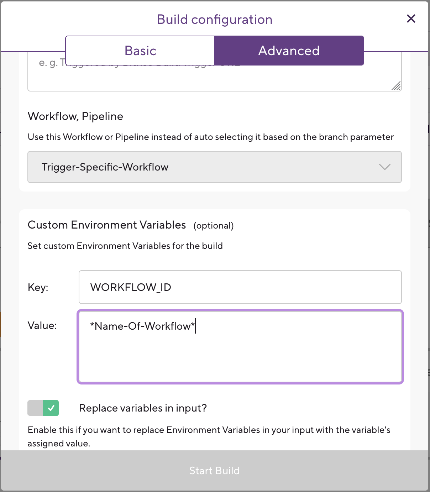
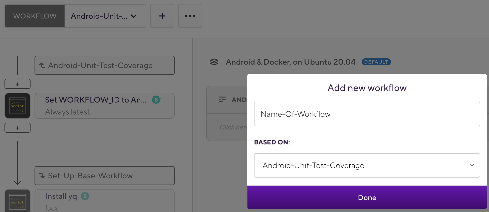
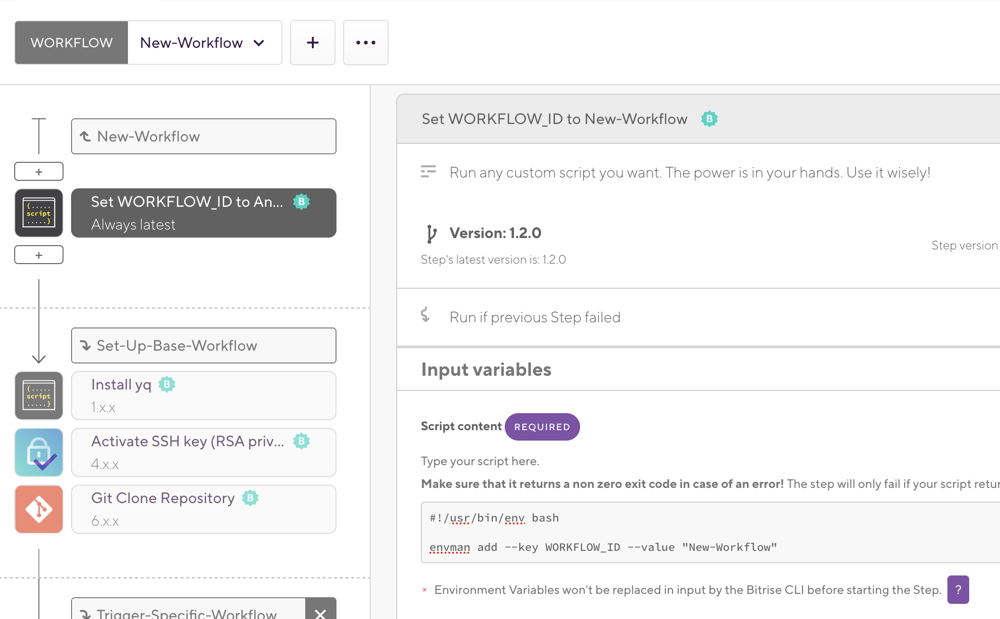

## How to define a new workflow?
To define a new workflow, we need to add it to the yml configuration of Bitrise. For ease of use and testing, we keep this configuration on the repository. This means that whatever changes you make to the configuration will be only available on the branch that this file has been committed.

This can be done by editing the yml configuration in Android Studio or your preferred yml editor. Or you can do it the recommended way and use the [Bitrise offline workflow editor](https://github.com/bitrise-io/bitrise-workflow-editor)
This editor works the same way the workflow editor in the web works.

##### Note
Because of the way our CI workflows are structured, make sure not to add a `git clone` step to your workflow. You will always have access to the `b2c` project on any workflow you define.
## How to run a new workflow?
Once you create the workflow in the configuration yml in the repository, this workflow won't be reflected in the website.
In order to run the new workflow we have created a helper workflow which can run any workflow from the repositories config file, `Trigger-Specific-Workflow`.

Usage of this workflow is as simple as adding the name of the workflow you want to run as an environment variable.

Although this is a simple way to run any workflow, it isn't all that user friendly. For ease of use Bitrise has a dropdown where you can choose which workflow you want to run. But since our configuration file exists inside the repository, Bitrise doesn't know what workflows exist.
## How to add a workflow to the drop down list?
In order to have your workflow listed on the drop down, we need to add the same workflow to the config in Bitrise web.
This is much easier than it sounds, as we don't have to duplicate the same workflow instead we just need to duplicate the name of the workflow.

These are the steps to add your workflow to the drop down list:
- Go Bitrise website and open the workflows tab
- Click on `+` to create a new workflow and choose `Android-Unit-Test-Coverage` as base workflow (this copies the steps used for this workflow)
  
- Change the first step environment variable value to the name of the workflow you want to run
  

##### Note
This step is only recommended for workflows which have to run manually and often.
## Why aren't we just using Bitrise config in web?
While it might seem like a lot of indirection and not straightforward to create new workflows, there are some great benefits which we believe make the effort worth it.
- Testing changes to a workflow in isolation
    - Since the configuration file is in the repository, all changes are isolated in a single commit
    - When updating the configuration in web, all branches were affected at the same time. Causing issues often
- Version controlled history and rollback possibility
    - In web we have no history of changes, and it was hard figuring out what changed or when
- Avoiding 200MB size limit of the bitrise.yml file on the web UI
    - This translates to roughly 2000 lines give or take
    - Having such a limit we had to optimize different workflows to have less steps and shorter scripts
    - We couldn't experiment a lot with new workflows
    - Now we have no limit and we can have as many workflows as we want
