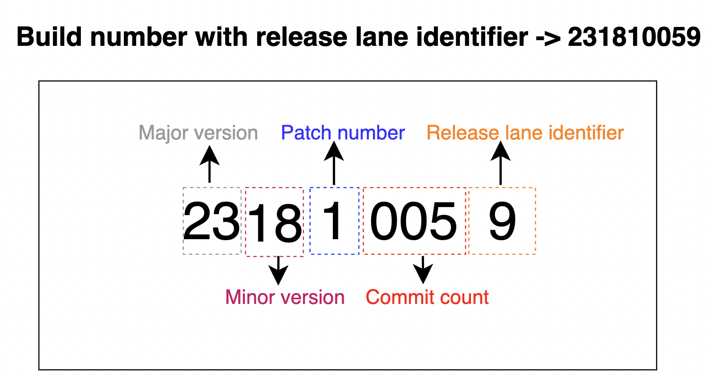

# Build number strategy

Some points which are considered in our build number,
- The build number should be incremental in nature.
- It should be uniform and reflect the state of the codebase in some way.
- Build number should be generated from a reference point in the codebase.
- Both platforms (iOS and Android) should be using the same strategy.

#### How build numbers are generated:

The build number is generated based on the current app version name, appVersionName in gradle.properties file and commits made on the branch which is used to create the build with reference to the `development` branch.

The commit count is calculated using the [github commits compare API](https://docs.github.com/en/rest/commits/commits#compare-two-commits).

We can look the following example to understand how a build number is generated,

Consider the following,
- The current app version is 23.18.1
- The number of commits made on target_branch is 5 compared to the development branch,
- The release lane for the build is `production` track (release lane identifier number for production track is 9), more about different release lanes can be found [here](https://docs.google.com/document/d/1ewJE12W81wY6jNrqVt06uy7S5zWW-kDDVy_1P5xUAmM/edit?usp=sharing)

then the versionCode will be,

```
versionCode = (((major_version * 100 + minor_version) * 10 + patch_version) * 1000 + commit_count) * 10 + release_lane_identifier_number

versionCode = (((23 * 100 + 18) * 10 + 1) * 1000 + 5) * 10 + 9

versionCode => 231810059

```

Here we multiply definite padding with each part of the app version name to make it 9 digits. Version code should be always greater than the previously uploaded version code to play store.

Please see the below image to better understand the different sections in the build number:



#### Release builds vs Feature builds

- If target_branch name starts with the prefix, release or hotfix, app version remains same as the value mentioned in gradle.properties.

- Otherwise the bitrise build number is appended as 4th component to the app version name

For example, consider the app version 23.18.1, and assume that the bitrise build number is 21424,

- If the target_branch is release/android/app_version or hotfix/android/app_version, then app version name of the build will be same, ie, `23.18.1`
- If the target_branch is a feature branch or bug fix branch, then app version name of the build will be `23.18.1.21424`

#### Support for versionCode override:

In some cases, you might need to provide a versionCode manually.

For example, if the latest release (22.22.0) had some issue there is a rollback to previous release (22.21.0), then for submitting to playstore the versionCode needs to be manually given to the workflow. To support such scenarios, we have added an option to provide the versionCode before running the workflow.

For doing this, Advanced mode of the btirise workflow should be used. The environment variable `VERSION_CODE_OVERRIDE` should be set to provide the required versionCode. Please keep in mind that the value given should only contain digits.
