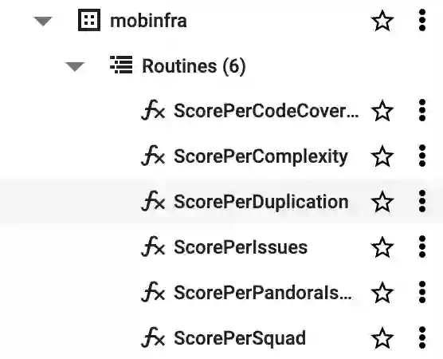
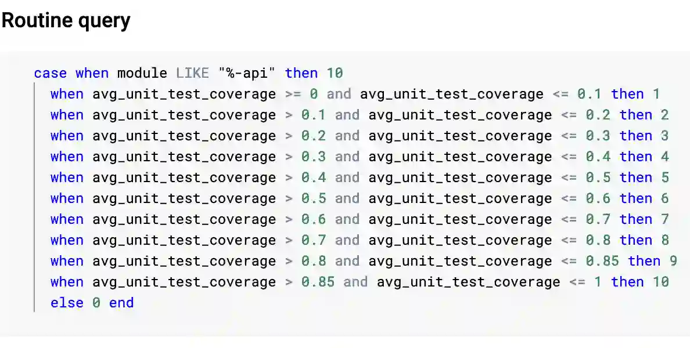
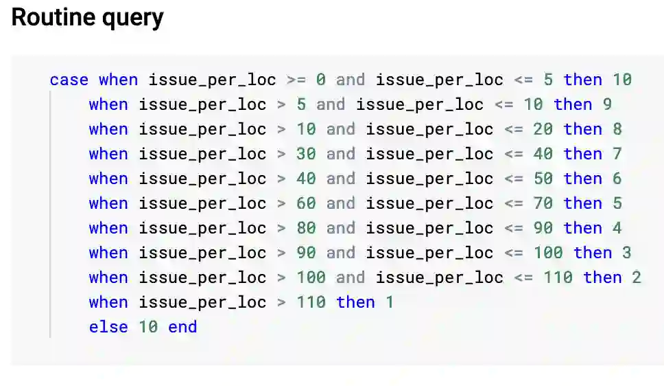
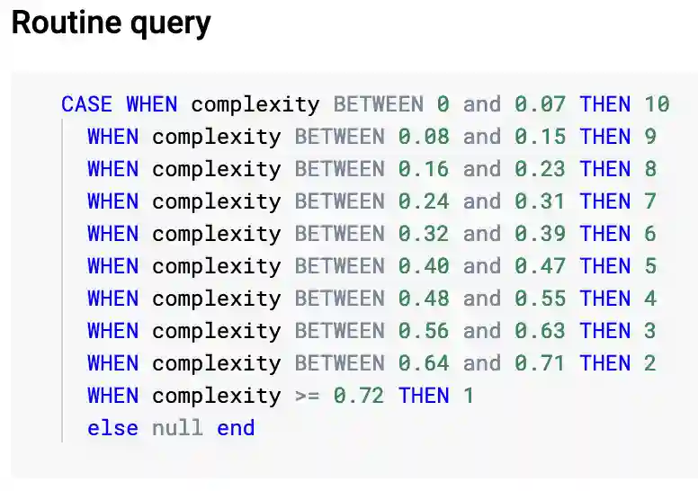
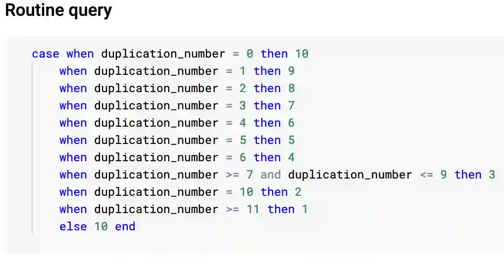
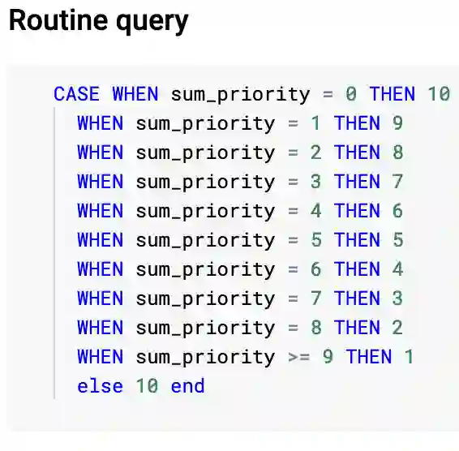
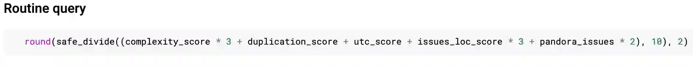

## What is this documentation for?
This document is a series of guides we have written for the Code Quality Dashboard that we use to track and improve our overall code quality of the project.
These guides are mostly targeted to people who want to know how the internals of the framework works.

## How do we calculate scores for each metric?
For better separation of concerns we've decided to use the capabilities of SQL to calculate the scores. This allows us to make faster changes, without requiring code reviews, on the calculation logic. For ease of use we've decided on using `Store Procedures` which succinctly encapsulate *"score calculation"* for each metric.
These can be found on the Big Query dashboard under `pandora-ta-results/mobinfra/Routines` and they look like this.

#### What are `Stored procedures`?
`Stored procedures` are `SQL` way of integrating functions. We are encapsulating the logic behind calculating the score behind a function eg: stored procedure. By doing this all we need to know is how to give the proper input and the procedure will give us the proper result.
For more information on what `Stored procedures` are and how they work on Big Query you can read on [the official documentation](https://cloud.google.com/bigquery/docs/procedures). 

### Code coverage
We are using a linear distribution of coverage, basically we try to map 0-100% range to 1-10 score.
The `stored procedure` is called `ScorePerCodeCoverage` and it looks like the picture below.

### Issues
We have decided to use a relative measure for issues, so we are calculating the amount of issues we have per 1000 lines of code in any single module. This means that the bigger the module, the more lenient we are with the amount of issues we allow. We've decided some arbitrary numbers to map them into the 1-10 range.
The `stored procedure` is called `ScorePerIssues` and it looks like the picture below.

### Complexity
Here we've also decided to use relative values. We measure the complexity per 1000 lines of code. The range, like `Issues` is arbitrary.
The `stored procedure` is called `ScorePerComplexity` and it looks like the picture below.

### Duplication
This metric is measured in absolute values. Our goal is not to have any duplicated code in the project, and whatever is duplicated should be somehow exctracted as an `-api`. Duplicate files are usually found in two different modules, that means that both modules will be penalized for having a duplicate file or lines in them.
As the other issues it's just a distribution of how many duplicate issues we've found mapped to a range of 1-10.
The `stored procedure` is called `ScorePerDuplication` and it looks like the picture below.

### Pandora issues/Initiatives
Unlike other metrics these ones have a priority attached to them. The priority ranges from 1 to 5, 5 being the highest priority. We calculate the score based on the sum of priorities of all the issues in a single module. The goal is to have 0, meaning we have 0 tech debt on these modules.
The `stored procedure` is called `ScorePerPandoraIssue` and it looks like the picture below.

**Example**: If a module has tech debt of using `tracking` module and `Rxjava2`. Since `pandora.deprecation.Tracking` has a priority of 5 and `pandora.deprecation.RxJava2` has a priority of 2, the tech debt score of this particular module would be 7, which in turn gives the module a score of 3. 

### Overall
An average of the scores from all the other issues, with some weights on more important issues, is how we come to the overall score.
The `stored procedure` is called `ScorePerSquad` and it looks like the picture below.

