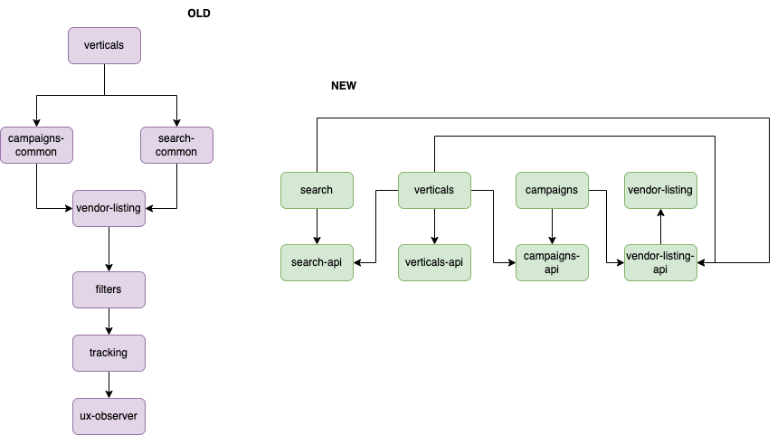
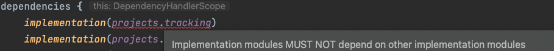
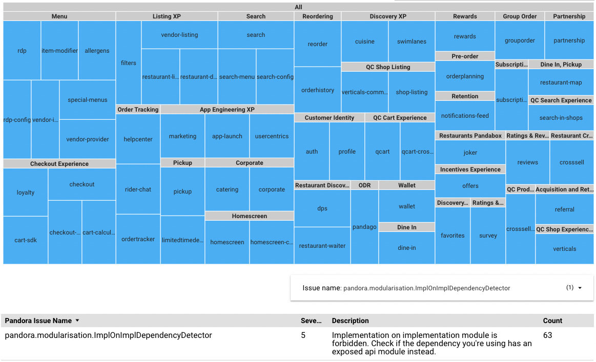

### Overview

B2C Android project follows a strict modularisation structure, according to which,
implementation module can't have direct dependency on another implementation module. If any kind of communication between modules is required, they have to expose their public contract via api modules and these api modules can be added as dependencies to implementation modules.

The image displays the old project's architecture which we are trying to migrate from, and the new modules structure.

This kind of structure serves multiple purposes:

- Faster build time, due to better CPU parallelization as modules don't have to wait until the whole dependency tree has compiled before starting own compilation
- Lesser cohesion between modules that leads to better code ownership and maintainability.
- Better code quality overall, as this module structure promotes design decisions with a public contract in mind

More info about why this structure is better for our project, can be found in this [presentation](https://docs.google.com/presentation/d/1v6keL6bO4kGg2JrDwHGfUq724QiyJIAGExu2IjO6xsM/edit#slide=id.p) and [video](https://drive.google.com/file/d/10R3MVrtlbOReqbdGxqYBcqhQeDvSErsb/view).

### Current status

Most of our modules already follow this structure, and new PRs introducing the wrong dependencies can't be merged, but we still have multiple modules that are violating the `Impl-On-Api` dependency rule.

### Issue Detection

There are several ways to see whether is a specific module requires the migration:

1. Check dependencies block in `build.gradle.kts`: wrong dependencies are reported with the lint error:
   
2. Code quality framework has the "Modularization Tech Debt" as one of its metric. To see the report, go to `Dashboard -> Drill Down -> Pandora Issues/Initiatives` and filter by the issue name `pandora.modularisation.ImplOnImplDependencyDetector`
   
3. [Modularization Tech Debt](https://docs.google.com/spreadsheets/d/1_rR5-dI0nYgTUr2xCLw_BnUaDG3uFJMmEB_NDTqHPRI/edit?usp=sharing) spreadsheet is displaying a list of all the modules that have dependency issues.
4. Running the CLI command `python3 scripts/code-quality-framework/detect-exposed-implementation-modules.py ` will show the most up-to-date info about the modularization issues.

### Definition of Done

The goal of this migration is to remove all the `Impl-On-Impl` and `Api-On-Impl` dependencies from all the modules. The migration succeeds when there is no modules with dependency issues (see **Issue Detection** section)

### Pandora's OKR affected by this migration

This initiative is part of the [OKR](https://docs.google.com/spreadsheets/d/1dTsuPo2nh8r_Vfln2NP6UjMrhlcGZrTXXDPE000UC6Y/edit#gid=1728391639)  **_"Drive internal efficiency and agility:  Accelerate feedback loops."_**

### Roadmap

- Eng Exp team to provide tools for detecting the issues and tracking the progress: **Done** ✓
- All teams
    - Check if owned modules have modules to migrate, create JIRA  tickets (use (this EPIC)[https://jira.deliveryhero.com/browse/MOBDEVX-1688]) for them and add to the spreadsheet / alert about possible blockers / notify EMs about necessity to allocate capacity to work on the tech debt.
    - Finish work on migration **by end of Q1**
        - _Note, that this is an indicative deadline, based on the assumption that in most cases the migration should be pretty straightforward and can be done within a couple of days max. But it's also possible that either due to blockers or lack of team capacity the migration can take longer - in this case please make sure to mention the expected issues in the spreadsheet._

### Migration Steps

#### For Dependency Owners

- If your module exists in the "dependency" column in the [spreadsheet](https://docs.google.com/spreadsheets/d/1_rR5-dI0nYgTUr2xCLw_BnUaDG3uFJMmEB_NDTqHPRI/edit?usp=sharing), it might be that it doesn't provide a public contract satisfying the communication needs of other modules. If this is the case, create a ticket to introduce such a contract and plan to work on it ASAP, as this will be a blocker for other teams.

#### For Module Owners

1. If your module exists in the "Used by module" column, check why the dependency on implementation module is needed there:
    - Run in the terminal `./gradlew {your-module-name}:reason --id :{module-dependency}`
    - The result will show which classes from the dependency module are in use, you can search these classes in the module's directory to see matches.
2. Check if the the dependency module provides same functionality via their contract in the api module.
3. If there is no api contract at all, or existing contract doesn't contain the required functionality, set your ticket status' to Blocked, and add a comment explaining the blocker to the Modularization Tech Debt [spreadsheet](https://docs.google.com/spreadsheets/d/1_rR5-dI0nYgTUr2xCLw_BnUaDG3uFJMmEB_NDTqHPRI/edit?usp=sharing), mentioning either an owner of the module, or anyone from Dev Exp team
4. If there is a proper API contract, use it to replace the implementation usages.

### Examples

[PR](https://github.com/deliveryhero/pd-mob-b2c-android/pull/22102) for migrating `:vendor-info` module from `projects.config` to `projects.configApi` dependency

### Related Documentation

For configs migration: [App configurations](https://urban-journey-e7eda8fe.pages.github.io/wiki/app-configuration/)

For analytics migration: [Analytics](https://urban-journey-e7eda8fe.pages.github.io/wiki/analytics/)

### Support

	Channel on Slack: #pd-squad-app-engineering-xp
	Handle for calendars and mentioning in the spreadsheet: @pandora-squad-mob-infra-xp@deliveryhero.com

