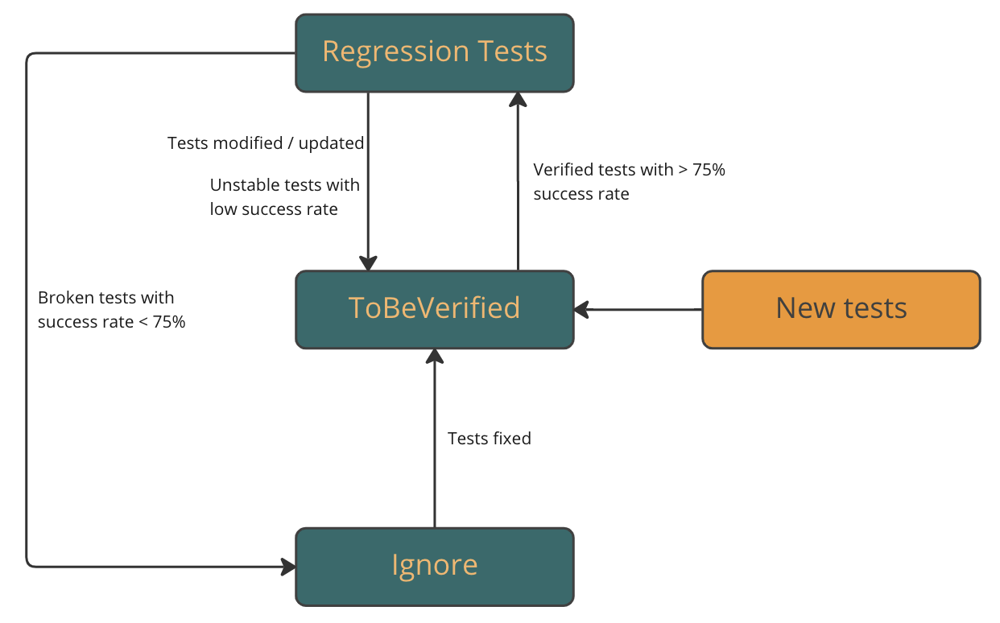

<h2>TA Success Rate monitoring and UI Test lifecycle</h2>

In order to ensure the quality of automated tests and utilize our resourses well, the success rate of the tests will be monitored on regular basis. The tests will be annotated with different annotation based on the state of the tests.
Depending on the annotation of the tests, they will be scheduled to run in different workflows with different frequencies.

<h3>Tests classification and Annotations</h3>

* `@RegressionTest` & `@{TribeName}` should only consist of stable tests. Newly added tests and modified/fixed tests should not be annotated with these annotations. Please note that sometimes the regression workflow is triggered through the tribe annotation and tests with only @RegressionTest might not be run in this scenario. A Regression test should be annotated with both.
* `@ToBeVerified{TribeName}` should only consist of newly added tests and modified/fixed tests. They can only be marked as @RegressionTest with Tribe annotation after verified as per the criteria mentioned below.
* `@Ignore` All the broken and unfixed tests with success rate lower than 75% should have this annotation.

Note: Please use only one set annotations. A newly added or fixed test should NOT have @RegressionTest and @ToBeVerified{TribeName} annotation. 

<h3>When Test is considered Verified</h3>

At the moment the criteria when the test is considered Verified is following:

* The success rate of test is >= 75% in duration of at least 2 weeks
* The total run count is >= 5

Due to the fact that we have a lot of UI tests and TA Infra team is not able to track the success rate of the tests on their own every week, test owners are advised to check success rates for their Squad (e.g. on a weekly basis), and open PR to request changing tests from the `@ToBeVerified{TribeName}` annotation to the `@RegressionTest` and `@TribeName` annotations.
At present we are also trying to automate this process. 

Test owners are advised to visit [Android Tests Dashboard](https://datastudio.google.com/u/0/reporting/e7b86dcf-1cc4-4b50-b11e-094de97bfa9b/page/p_6vji9oaayc) weekly to examine the latest status of the tests. 

<h3>Schedule of the Test Runs</h3>

At the moment we have 2 types of workflows that run automatically:

* `Regression` runs
* `ToBeVerified` runs (WIP)

`Regression` runs are scheduled to be run every other day at night, 3 days a week on Tuesday, Thursday and Saturday at 20:00 Berlin Time. It triggers Regression tests by all the Tribes with both annotation `@{TribeName}`, and `@RegressionTest`, and without `@Ignore`. It is running `development-regression` branch. These test runs are also triggered whenever new Release Candidate is created, to run against `release/android/*` branch. The results of this execution are uploaded to TestRail (the tests change the status from Needs TA Updates to Passed or Failed)

`ToBeVerified` runs are scheduled to be run everyday at 21:30 Berlin Time. All the tests with annotation `@ToBeVerified{TribeName}` and without `@Ignore` will be included. The statics will also be added in to Android Tests Dashboard.

<h3>Questions and contacts</h3>

If there is any questions or doubts, please contact us via slack channel `#pd-fd-automation_infra`
